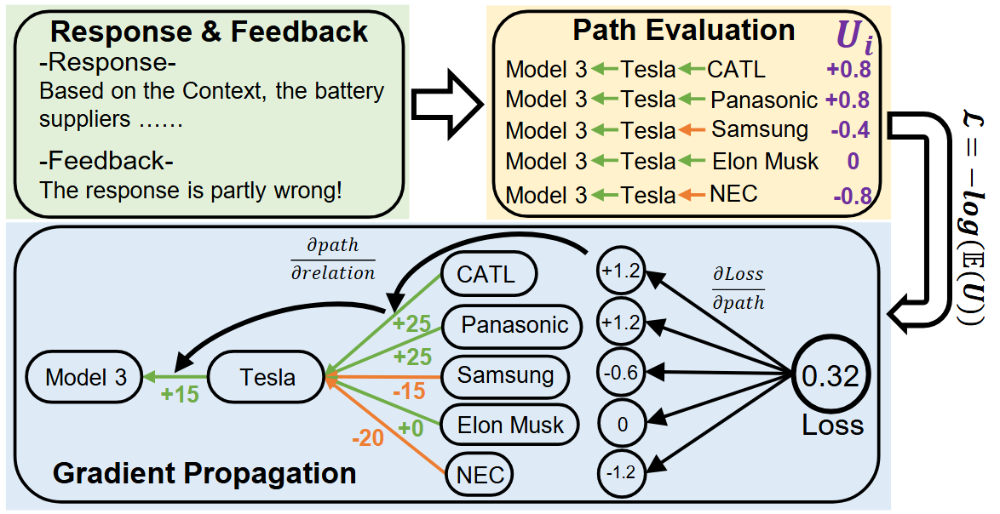

<!-- <div align="center" style="display: flex; align-items: center; justify-content: center;">
  
  <h2 style="display: inline; vertical-align: middle;">NeutronRAG: Towards Understanding Vector-based RAG and Graph-based RAG</h2>
</div>

<p align="center">
  
</p>
<p align="center">Overall architecture of NeutronRAG</p> -->

# EvoRAG: Evolving KG-based RAG with Human Feedback-driven Backpropagation

<p align="center">
  
</p>
<p align="center">Self-evolving KG-RAG framework</p>


## Project Structure
- `requirements.txt` Python dependencies  
- `run.sh`      Launch script  
- `chat/`      LLM prompts (see `chat_graphrag.py`)  
- `config/`     Configuration files  
- `database/`    Persistent storage  
- `dataset/`    Raw datasets  
- `KGModify/`    Core graph-modification logic  
- `llmragenv/`     LLM interface layer  
- `logs/`      Runtime logs  
- `utils/`      Shared utilities  
- `kg_modify.py`  Entry point

## 🔨Setup

```bash


# Create conda environment: python >= 3.10
conda create --name llmrag python=3.10.14 -y

conda activate llmrag

# Install required Python packages:
pip install -r requirements.txt

```

## Test if OLlama is available:
```bash
ollama run llama2:7b
```


📦 Deploy Graph Database
1. NebulaGraph Installation Guide
Step 1: Install docker-compose
Ensure that you have docker-compose installed. If not, you can install it with the following command:

```bash
sudo apt install docker-compose
```
Step 2: Clone NebulaGraph Docker Compose Repository
In a directory of your choice, clone the NebulaGraph Docker Compose files:

```bash
git clone https://github.com/vesoft-inc/nebula-docker-compose.git
cd nebula-docker-compose
```
Step 3: Start NebulaGraph
In the nebula-docker-compose directory, run the following command to start NebulaGraph:

```bash
docker-compose up -d
```
Step 4: Check NebulaGraph Container Status
After starting, you can verify that the NebulaGraph container is running by using:

```bash
docker ps
```
Step 5: Connect to NebulaGraph
To connect to NebulaGraph inside the container, use the following command:

```bash
nebula-console -u <user> -p <password> --address=graphd --port=9669
#Replace <user> and <password> with the actual username and password. Ensure that port 9669 is used for the default configuration.
```
Step 6: Enable Data Persistence
To ensure that data persists even after the container is restarted, you can mount persistent volumes. Either modify the volumes section in the docker-compose.yaml file, or manually run the following command with specified persistence paths:

```bash
docker run -d --name nebula-graph \
    -v /yourpath/nebula/data:/data \
    -v /yourpath/nebula/logs:/logs \
    -p 9669:9669 \
    vesoft/nebula-graphd:v2.5.0
#Replace /yourpath/nebula with your actual data persistence path.
```


2. Neo4j (Installation optional for now)


## 💄 Run  
Start everything with one command:  
```bash
bash run.sh
```

# Notion

1. .env file loading is deprecated. Now uses client input, including LLM name
2. The method low_chat() in ./llmragenv/llmrag_env.py is a simplified input version where the LLM name, database usage, etc., are hardcoded. The web_chat method is the full version.
3. LLM support: The llm_provider dictionary in llm_factory lists all currently supported local models. (Commercial model API keys are not enabled here due to cost, but users can purchase them separately and configure in ./config/config-local.yaml.)
4. Frontend ports and database configurations can be modified in ./config/config-local.yaml (vector DB and NebulaGraph are hardcoded in the code, and need refactoring)
5. Code structure:


